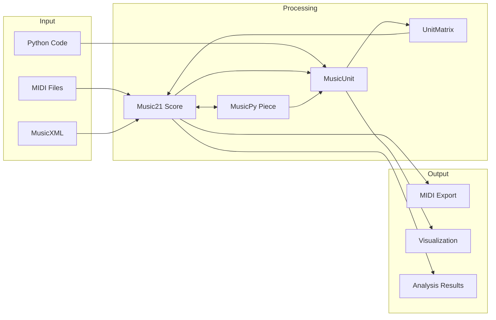

# Musicom Architecture Review

## Executive Summary

**Musicom** is a Python-based music composition and analysis framework that provides a comprehensive toolkit for algorithmic music generation, transformation, and analysis. The project leverages both `music21` and `musicpy` libraries to bridge music theory concepts with computational approaches.

---

## Project Structure Overview

```mermaid
graph TB
    subgraph Core Layer
        S[structures/] --> U[MusicUnit]
        S --> P[MusicProject]
        S --> M[UnitMatrix]
        S --> PC[MusicPitchClass]
        S --> PP[MusicPitchClassSet]
        S --> TG[MusicTimeGrid]
    end
    
    subgraph Generation Layer
        G[generators/] --> PG[PatternGenerator]
        G --> MG[MarkovChainGenerator]
        G --> GG[GeneticGenerator]
        G --> SG[StochasticGenerator]
        G --> HG[HarmonicsGenerator]
        G --> RG[RhythmGenerator]
        G --> CG[ChordDegreeGenerator]
    end
    
    subgraph Transformation Layer
        T[transformers/] --> CT[CanonTransformer]
        T --> PST[PitchSequenceTransformer]
        T --> MT[Matrix Operations]
    end
    
    subgraph Rules Layer
        R[rules/] --> CP[Counterpoint]
        R --> PR[Progression]
        R --> MV[Movement]
    end
    
    subgraph IO Layer
        C[converters/] --> MIDI[MIDI I/O]
        C --> M21[Music21 Converters]
        C --> MP[MusicPy Converters]
    end
    
    subgraph Analysis Layer
        A[analysis/] --> M21A[Music21 Analysis]
        A --> MPA[MusicPy Analysis]
    end
    
    subgraph Visualization Layer
        V[visualization/] --> HX[Helix]
        V --> CY[Cycle]
    end
    
    Core Layer --> Generation Layer
    Core Layer --> Transformation Layer
    Generation Layer --> IO Layer
    Transformation Layer --> IO Layer
    Core Layer --> Analysis Layer
    Core Layer --> Visualization Layer
```

---

## Module Analysis

### 1. Structures Module - [`structures/`](structures/)

The core data structures that represent musical concepts:

| Class | File | Purpose |
|-------|------|---------|
| [`MusicEvent`](structures/unit.py:8) | unit.py | Single musical event with pitch, volume, start/end ticks |
| [`MusicUnit`](structures/unit.py:59) | unit.py | Sequence of MusicEvents stored in numpy structured arrays |
| [`MusicVoice`](structures/project.py:12) | project.py | Horizontal voice with instrument assignment |
| [`MusicSection`](structures/project.py:26) | project.py | Project section containing matrix columns |
| [`MusicProject`](structures/project.py:47) | project.py | Top-level container for compositions |
| [`UnitMatrix`](structures/matrix.py:7) | matrix.py | 2D matrix for compositional manipulation |
| [`MusicPitchClass`](structures/pitch.py:22) | pitch.py | 12-TET pitch class definitions |
| [`MusicPitchGrid`](structures/pitch.py:58) | pitch.py | Chromatic pitch set with helix representation |
| [`MusicPitchClassSet`](structures/pitchpattern.py:275) | pitchpattern.py | Pattern-based pitch sequences |
| [`MusicTimeGrid`](structures/timegrid.py:4) | timegrid.py | Time structure with meter and tempo |
| [`MusicRhythmPattern`](structures/timegrid.py:53) | timegrid.py | Common rhythm patterns |

**Strengths:**
- Efficient numpy-based storage for [`MusicEvent`](structures/unit.py:8) data
- Clean separation between pitch, time, and structural concepts
- Matrix-based composition framework enables systematic development
- Support for both absolute pitches and pitch class patterns

**Areas for Improvement:**
- [`MusicUnit`](structures/unit.py:59) has an [`old_set()`](structures/unit.py:171) method that appears deprecated
- Some inconsistency in property vs method naming - e.g., [`durations()`](structures/unit.py:167) is a method while [`pitches`](structures/unit.py:149) is a property
- [`MusicPitchRange`](structures/pitch.py:120) class is incomplete - missing methods for range operations

---

### 2. Generators Module - [`generators/`](generators/)

Algorithmic composition generators:

| Generator | File | Algorithm |
|-----------|------|-----------|
| [`PatternGenerator`](generators/pitchpattern.py:9) | pitchpattern.py | Pattern-based melody/arpeggio generation |
| [`MarkovChainGenerator`](generators/chain.py:10) | chain.py | Probabilistic sequence generation |
| [`GeneticGenerator`](generators/genetic.py:15) | genetic.py | Evolutionary composition with fitness functions |
| [`StochasticGenerator`](generators/stochastic.py) | stochastic.py | Random music generation |
| [`HarmonicsGenerator`](generators/harmonics.py) | harmonics.py | Overtone-based composition |
| [`RhythmGenerator`](generators/rhythm.py) | rhythm.py | Rhythmic pattern generation |
| [`ChordDegreeGenerator`](generators/chord_degrees.py) | chord_degrees.py | Chord progression generation |

**Strengths:**
- Good variety of generation algorithms
- Abstract base class [`MusicGenerator`](generators/base.py:7) provides consistent interface
- [`GeneticGenerator`](generators/genetic.py:15) has well-implemented crossover and mutation

**Areas for Improvement:**
- [`PatternGenerator.generate()`](generators/pitchpattern.py:28) has duplicate code blocks - same logic repeated three times
- [`MarkovChainGenerator`](generators/chain.py:10) has unused [`generate_unit_from_sequence()`](generators/chain.py:65) method that calls non-existent `unit.append()` method
- Missing documentation for generator parameters and expected outputs

---

### 3. Transformers Module - [`transformers/`](transformers/)

Musical transformation operations:

| Transformer | File | Operations |
|-------------|------|------------|
| [`CanonTransformer`](transformers/canon.py:7) | canon.py | Canon generation with voice delays |
| [`PitchSequenceTransformer`](transformers/pitchsequence.py:8) | pitchsequence.py | Serial transformations - P, I, R, RI |

**Strengths:**
- Integration with music21's serial module for tone row operations
- Clean transformer interface

**Areas for Improvement:**
- [`CanonTransformer.transform()`](transformers/canon.py:26) has multiple TODO comments indicating incomplete implementation
- Missing retrograde transformer file referenced in [`__init__.py`](transformers/__init__.py:5)
- [`__all__`](transformers/__init__.py:7) list contains `'matrix.py'` instead of function name

---

### 4. Rules Module - [`rules/`](rules/)

Music theory rules and constraints:

| Class | File | Purpose |
|-------|------|---------|
| [`Counterpoint`](rules/counterpoint.py:13) | counterpoint.py | Two-voice counterpoint analysis |
| [`PatternMovementRules`](rules/progression.py:27) | progression.py | Chord progression rules |
| [`PatternMovement`](rules/progression.py:59) | progression.py | Common chord progressions |
| [`Scale7ChordDegree`](rules/progression.py:127) | progression.py | Diatonic chord functions |

**Strengths:**
- Comprehensive chord progression definitions
- Support for both major and minor mode progressions
- Harmonic function definitions - Tonic, Dominant, Subdominant

**Areas for Improvement:**
- [`Counterpoint.has_crossing_voices()`](rules/counterpoint.py:33) has incorrect return logic - returns `True` when voices cross
- Missing implementation for secondary dominants and modal interchange as noted in TODO

---

### 5. Converters Module - [`converters/`](converters/)

Format conversion utilities:

| Converter | File | Purpose |
|-----------|------|---------|
| [`midifile_to_piece()`](converters/midi_converter.py:8) | midi_converter.py | MIDI to MusicPy piece |
| [`score_to_midifile()`](converters/midi_converter.py:13) | midi_converter.py | Music21 score to MIDI |
| [`midifile_to_score()`](converters/midi_converter.py:18) | midi_converter.py | MIDI to Music21 score |

**Strengths:**
- Bidirectional conversion between Music21 and MusicPy
- Support for multiple file formats

**Areas for Improvement:**
- [`__init__.py`](converters/__init__.py) is nearly empty - converters not properly exported
- Hardcoded Windows path in [`Config.DEFAULT_PATH`](utilities/config.py:7)
- Missing error handling for file operations

---

### 6. Analysis Module - [`analysis/`](analysis/)

Music analysis tools:

| Function | File | Purpose |
|----------|------|---------|
| [`score_analyze()`](analysis/music21_analysis.py:7) | music21_analysis.py | Music21-based score analysis |
| [`piece_analyze()`](analysis/musicpy_analysis.py) | musicpy_analysis.py | MusicPy-based piece analysis |

**Strengths:**
- Key detection and chord identification
- Roman numeral analysis with key context
- Metrical analysis with beat depth

**Areas for Improvement:**
- [`score_analyze()`](analysis/music21_analysis.py:7) has side effects - modifies input score and shows plots
- No return value from analysis functions - results only printed

---

### 7. Visualization Module - [`visualization/`](visualization/)

Visual representations:

| Class | File | Purpose |
|-------|------|---------|
| [`Helix`](visualization/helix.py:12) | helix.py | 3D helix visualization of pitch space |
| [`Cycle`](visualization/cycle.py:5) | cycle.py | Circular pitch class visualization |

**Strengths:**
- Clean matplotlib integration
- Configurable visualization parameters

**Areas for Improvement:**
- Limited visualization options - only helix and cycle
- No piano roll or score visualization

---

## Data Flow Architecture



---

## Key Design Patterns

### 1. Matrix-Based Composition
The [`UnitMatrix`](structures/matrix.py:7) class implements a 2D compositional framework:
- **Rows** = Voices in pitch space
- **Columns** = Sections in time space
- **Cells** = [`MusicUnit`](structures/unit.py:59) objects

Operations include:
- Row transformations: transpose, retrograde, invert, augment
- Column operations: repeat, insert, reorder
- Cell operations: swap, mutate
- Matrix operations: transpose, diagonal read, selective erase

### 2. Generator Pattern
All generators inherit from [`MusicGenerator`](generators/base.py:7) abstract base class:
```python
class MusicGenerator(ABC):
    @abstractmethod
    def generate(self) -> List[MusicUnit]:
        pass
```

### 3. Transformer Pattern
Transformers modify [`MusicUnit`](structures/unit.py:59) objects:
```python
class MusicTransformer:
    def transform(self) -> List[MusicUnit]:
        pass
```

---

## Identified Issues

### Critical Issues

1. **Missing Module**: [`transformers/retrograde.py`](transformers/retrograde.py) is imported in [`__init__.py`](transformers/__init__.py:5) but does not exist

2. **Broken Method**: [`MarkovChainGenerator.generate_unit_from_sequence()`](generators/chain.py:65) calls `unit.append()` which does not exist on [`MusicUnit`](structures/unit.py:59)

3. **Logic Error**: [`Counterpoint.has_crossing_voices()`](rules/counterpoint.py:33) returns `True` when voices cross instead of `False`

### Moderate Issues

4. **Duplicate Code**: [`PatternGenerator.generate()`](generators/pitchpattern.py:28) repeats the same pattern-to-pitch conversion logic three times

5. **Incomplete Implementation**: [`CanonTransformer.transform()`](transformers/canon.py:26) has multiple TODO items for delay, stacking, and onset adjustment

6. **Side Effects**: [`score_analyze()`](analysis/music21_analysis.py:7) modifies input score and displays plots without option to disable

7. **Platform-Specific Path**: [`Config.DEFAULT_PATH`](utilities/config.py:7) uses Windows path format

### Minor Issues

8. **Inconsistent Naming**: Mix of methods and properties for similar operations - [`durations()`](structures/unit.py:167) vs [`pitches`](structures/unit.py:149)

9. **Empty Exports**: [`converters/__init__.py`](converters/__init__.py) has empty `__all__` list

10. **Typo in Export**: [`transformers/__init__.py`](transformers/__init__.py:8) exports `'matrix.py'` instead of function name

---

## Test Coverage Analysis

The test files show coverage for:
- ✅ Project structure creation
- ✅ Pitch class operations
- ✅ Pattern definitions
- ✅ Time grid operations
- ✅ Generator usage
- ⚠️ Transformer operations - limited
- ⚠️ Converter operations - limited
- ❌ Error handling paths
- ❌ Edge cases

---

## Recommendations

### High Priority

1. **Fix Critical Bugs**
   - Create missing [`retrograde.py`](transformers/retrograde.py) module or remove import
   - Fix [`MarkovChainGenerator.generate_unit_from_sequence()`](generators/chain.py:65) to use correct method
   - Fix [`Counterpoint.has_crossing_voices()`](rules/counterpoint.py:33) return logic

2. **Complete Implementations**
   - Finish [`CanonTransformer`](transformers/canon.py:7) with delay and stacking logic
   - Implement [`MusicPitchRange`](structures/pitch.py:120) methods

3. **Refactor Duplicate Code**
   - Extract common pattern-to-pitch logic in [`PatternGenerator`](generators/pitchpattern.py:9)

### Medium Priority

4. **Improve API Consistency**
   - Standardize property vs method naming
   - Add proper exports to [`converters/__init__.py`](converters/__init__.py)
   - Fix [`transformers/__init__.py`](transformers/__init__.py) exports

5. **Add Configuration**
   - Make paths configurable and cross-platform
   - Add options to disable side effects in analysis

6. **Enhance Documentation**
   - Add docstrings to all public methods
   - Document expected inputs/outputs for generators

### Low Priority

7. **Extend Visualization**
   - Add piano roll visualization
   - Add score notation display

8. **Improve Test Coverage**
   - Add tests for error handling
   - Add edge case tests
   - Add integration tests

---

## Conclusion

Musicom is a well-architected music composition framework with a solid foundation. The matrix-based composition approach is innovative and provides powerful systematic development capabilities. The main areas needing attention are:

1. Fixing critical bugs in existing code
2. Completing partially implemented features
3. Improving code consistency and documentation

The project successfully bridges music theory concepts with computational approaches and provides a good variety of generation and transformation algorithms.
